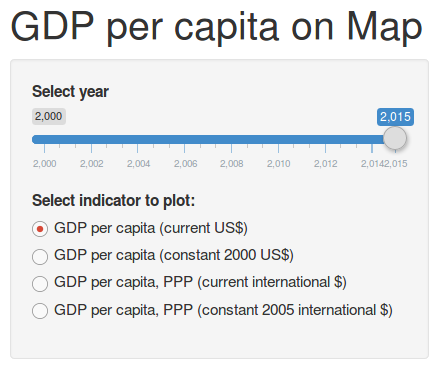

<style>

.footer-left {  
    position: fixed;  
    top: 95%;  
    left: 0%;  
    text-align: left;  
    width:85%;  
}  
  
.footer-right {  
    position: fixed;  
    top: 95%;  
    right: 0%;  
    text-align: right;  
    width:15%;  
}  
  
.col2 {  
    columns: 2 200px;           /* number of columns and width in pixels*/
    -webkit-columns: 2 200px;   /* chrome, safari */
    -moz-columns: 2 200px;      /* firefox */
}  
  
</style>


GDP Choropleth Map of the World
========================================================
author: Svetlana Aksyuk
date: 16 Apr. 2017
autosize: true


<!-- Нижний колонтитул -->
<div class = "footer-left" style = "font-size: 70%; color: white; width:50%;">Developing Data Products @ coursera.com</div>
<div class = "footer-right" style = "font-size: 70%; color: white; width:50%;">Course Project</div>


Explore World Bank GDP indicators
========================================================

- Select one of four indicators of GDP per capita   
  
- Choose year  
  
- Generate choroplet world map  
  
- Measure inequality among countries with Gini coefficient: coefficient of 1 (or 100%) expresses maximal inequality among values   
  
- See top and low 5 countries by chosen indicator   

<!-- Нижний колонтитул -->

<div class = "footer-left" style = "font-size: 70%;"><em>GDP Choropleth Map of the World</em></div>
<div class = "footer-right" style = "font-size: 70%;">2</div>


Application input
========================================================

<div align = 'center'></div>

***

<font size = 6>

**"Select year" slider:**

- Years range from 2000 to 2015   

**"Select indicator to plot" radio button:**

- GDP per capita available in constant and current prices, in US dollars and at purchasing power parity  
  
- The application downloads data from the World Bank database via API  

</font>

<!-- Нижний колонтитул -->

<div class = "footer-left" style = "font-size: 70%;"><em>GDP Choropleth Map of the World</em></div>
<div class = "footer-right" style = "font-size: 70%;">3</div>


Application calculated output
========================================================

<font size = 6>

The application calculates Gini coefficient [1]. If $n$ is number of countries, $x_i$ -- GDP per capita of country $i$:     
$$
G = \sum_{i = 1}^n \sum_{j = 1}^n \big | x_i - x_j \big | \bigg / \bigg ( 2 n \sum_{i = 1}^n x_i \bigg )
$$
  
Gini index for GDP per capita (current US$) in 2015:  


```r
library('WDI'); library('reldist')
DT <- na.omit(data.frame(WDI('all', 'NY.GDP.PCAP.CD',
                             2015, 2015))[48:264, ])
head(DT, n = 2)
```

```
   iso2c     country NY.GDP.PCAP.CD year
48    AF Afghanistan       594.3231 2015
49    AL     Albania      3945.2176 2015
```

```r
round(gini(DT[, 3]), 2)
```

```
[1] 0.64
```
</font>

<!-- Нижний колонтитул -->

<div class = "footer-right" style = "font-size: 70%;">4</div>


References
========================================================

<font size = 5>

1. Gini coefficient From Wikipedia, the free encyclopedia. URL <a href = "https://en.wikipedia.org/wiki/Gini_coefficient">https://en.wikipedia.org/wiki/Gini_coefficient</a>   

1. Winston Chang, Joe Cheng, JJ Allaire, Yihui Xie and Jonathan McPherson (2017). shiny: Web Application Framework for R. R package version 1.0.1. <a href = "https://CRAN.R-project.org/package=shiny">https://CRAN.R-project.org/package=shiny</a>

2. Vincent Arel-Bundock (2013). WDI: World Development Indicators (World Bank). R package version 2.4. <a href = "https://CRAN.R-project.org/package=WDI">https://CRAN.R-project.org/package=WDI</a>  
  
3. Markus Gesmann and Diego de Castillo. Using the Google Visualisation API with R. The R Journal,
  3(2):40-44, December 2011.  
  
4. Mark S. Handcock and Martina Morris (1999) Relative Distribution Methods in the Social Sciences.
  Springer, New York, ISBN 0-387-98778-9. URL <a href = "http://www.stat.ucla.edu/~handcock/RelDist">http://www.stat.ucla.edu/~handcock/RelDist</a>  

5. Mark S. Handcock (2016), Relative Distribution Methods. Version 1.6-6. Project home page at
  http://www.stat.ucla.edu/~handcock/RelDist. URL <a href = "https://CRAN.R-project.org/package=reldist">https://CRAN.R-project.org/package=reldist</a>  
  
6. Matt Dowle and Arun Srinivasan (2017). data.table: Extension of `data.frame`. R package version 1.10.4. <a href = "https://CRAN.R-project.org/package=data.table">https://CRAN.R-project.org/package=data.table</a>  

</font>

<!-- Нижний колонтитул -->

<div class = "footer-right" style = "font-size: 70%;">5</div>
